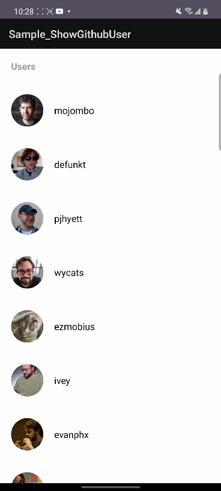

# Github用戶清單

**路徑**
---
Sample_ShowGithubUser

**效果**
---

**原理**
---
在RecyclerView.Adapter內再封裝一個RecyclerView.Adapter實現上方顯示HeaderView下方顯示Recycler item，由LRecyclerFooterModel實現RecyclerView初始化與上滑加載更多的功能並定義外部操作的方法；頁面使用MVP架構，Presenter確認數據後回調目前該執行的操作，Repository負責call api取得遠端數據。

**操作**
---
1.LRecyclerFooterModel的回調

- initInnerAdapter()設定要被封裝的Adapter
- getMoreData()需要執行加載數據

2.UserListPresenter的回調

- getPage(since: Int,pageNumber: Int)取得分頁數據
- finishGetValue()數據已全部取得
